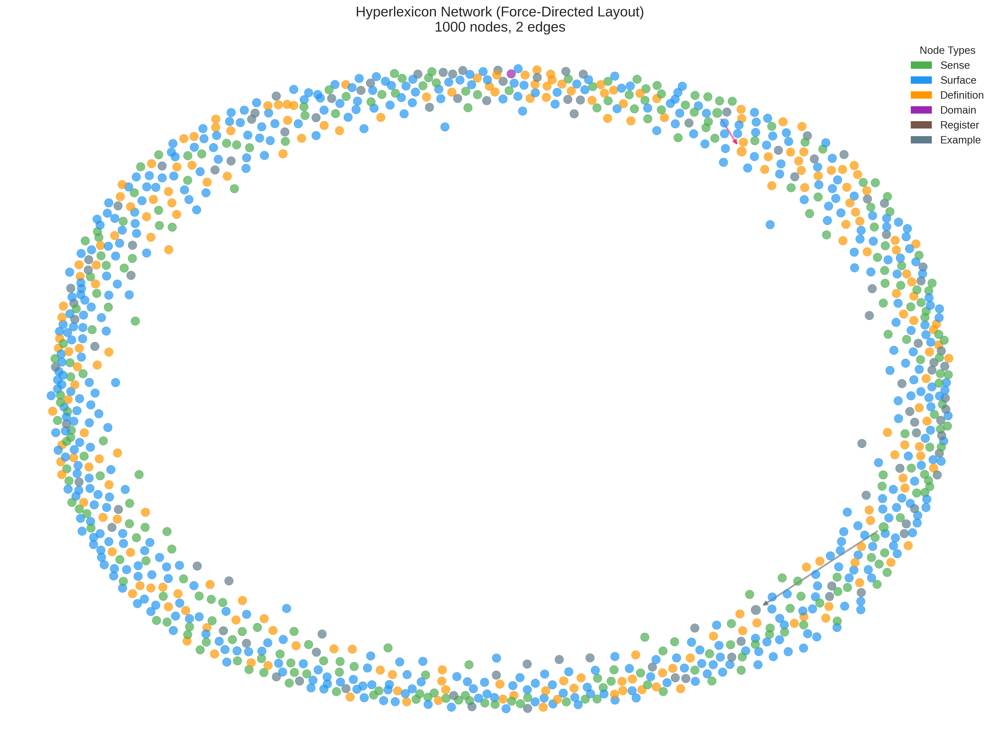
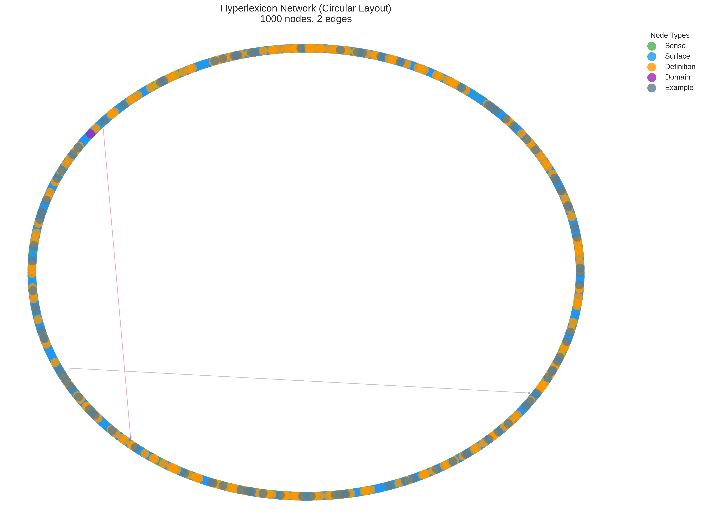
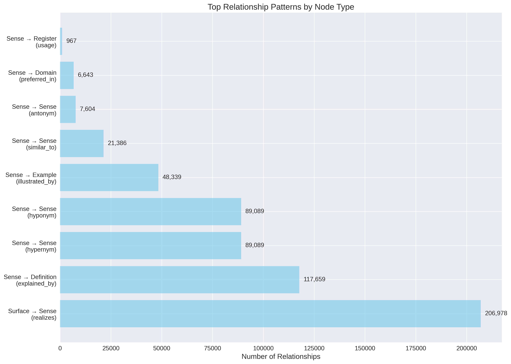
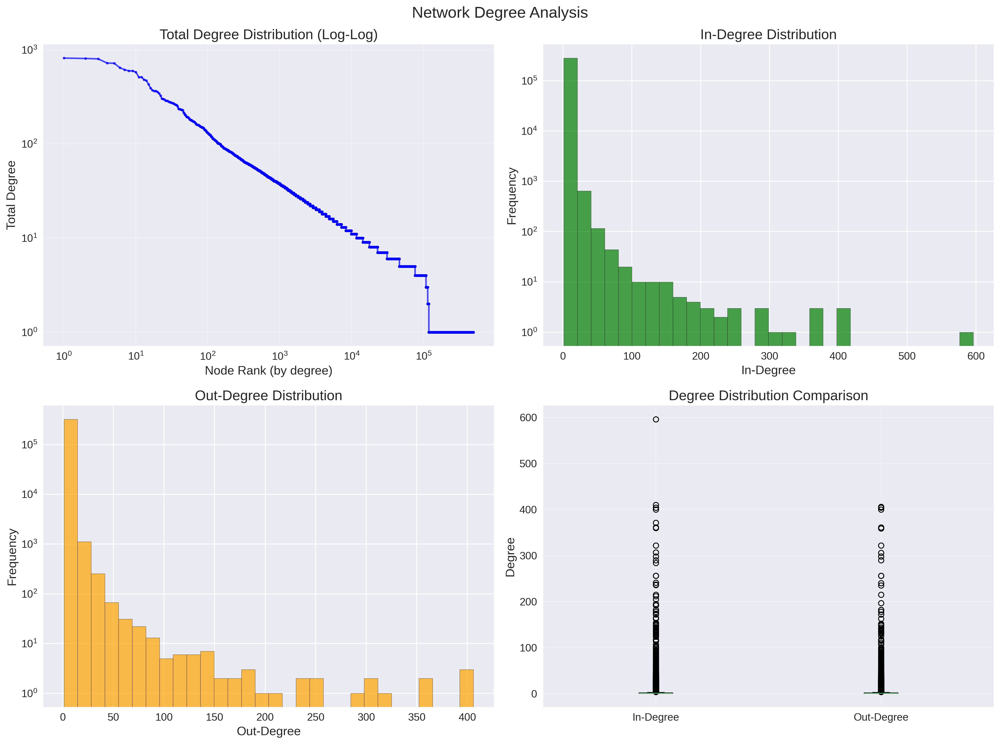
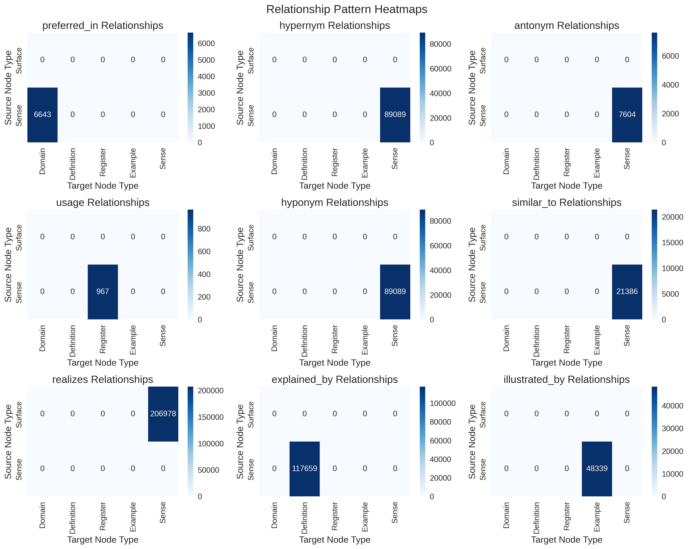
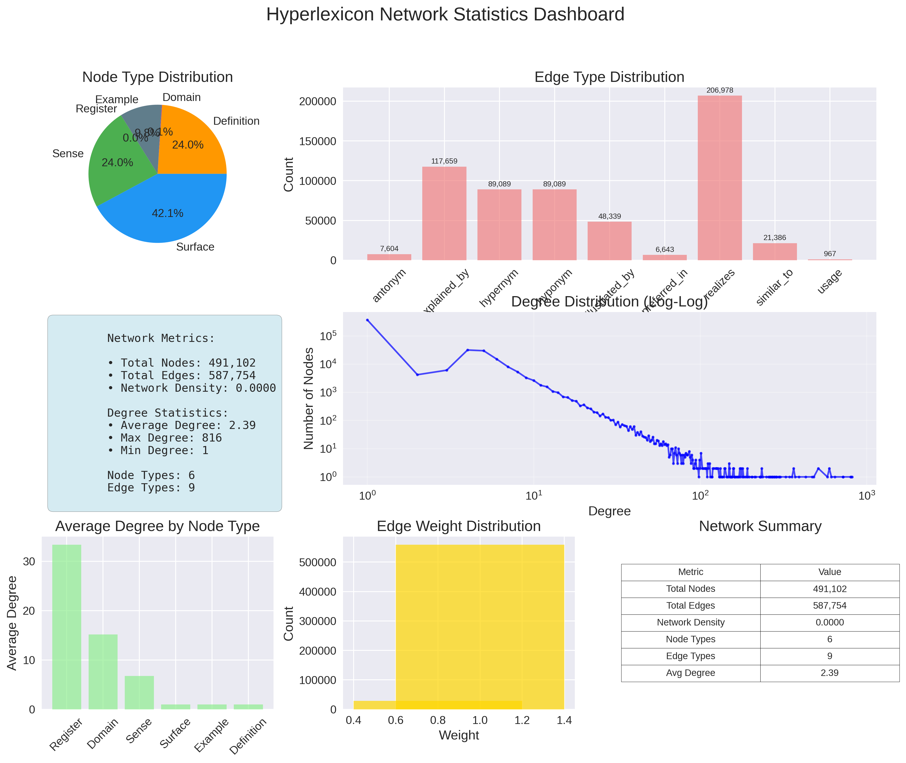
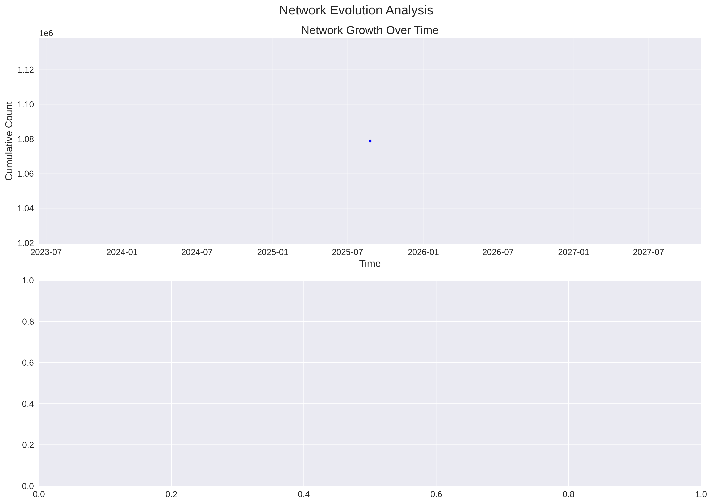

# Hyperlexicon Network Visualizations

This document indexes all generated network visualizations.

Generated on: 2025-08-24T14:05:35.023793

## Whole Network Visualizations

### Whole Network Force Directed

### Whole Network Circular

## Structural Analysis

### Network By Node Type

### Degree Distributions

### Hierarchical Structure

### Relationship Heatmap

## Subgraph Analysis

### Neighborhood Node 104504

### Neighborhood Node 21795

### Neighborhood Node 29441

## Statistical Dashboards

### Comprehensive Network Stats

### Network Evolution

## Visualization Descriptions

### whole_network_force_directed.png
Force-directed layout showing the entire network structure with nodes colored by type and sized by degree.

### whole_network_circular.png
Circular layout organizing nodes by type with relationships shown as colored edges.

### network_by_node_type.png
Bar chart showing relationship patterns between different node types.

### degree_distributions.png
Multiple plots showing in-degree, out-degree, and total degree distributions.

### hierarchical_structure.png
Visualization of hypernym/hyponym hierarchical relationships.

### relationship_heatmap.png
Heatmap showing the frequency of different relationship types between node types.

### comprehensive_network_stats.png
Dashboard with multiple network metrics and statistics.

### network_evolution.png
Time-series analysis of network growth and evolution.

